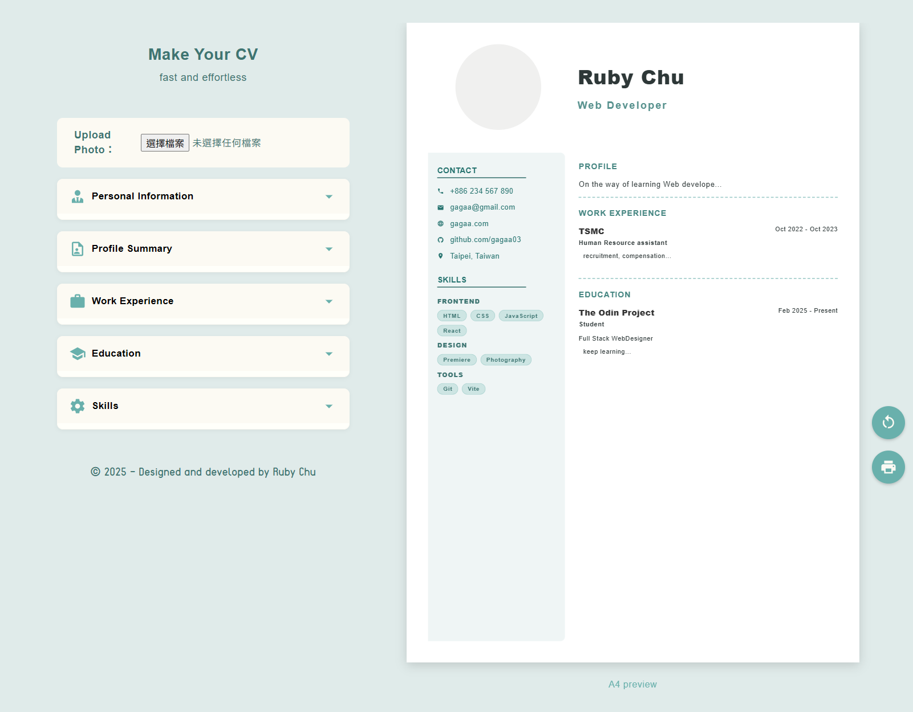
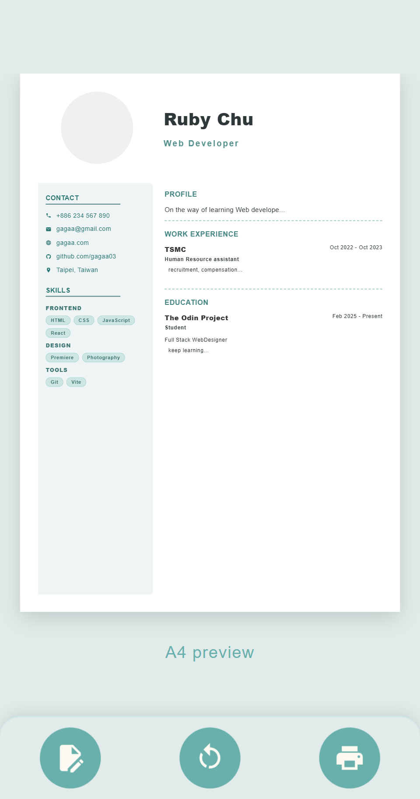
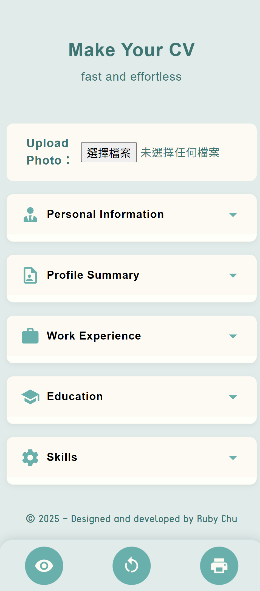

### Interactive CV Builder (互動式履歷產生器)
> 支援即時預覽、自動換行、以及可列印、PDF導出的履歷編輯器。

<br />
<br />

<p align="left">
  
  <br>
  <em>電腦版：1:1 精準 A4 預覽與即時編輯介面</em>
</p>

<br/>

<p align="left">
  
  &nbsp;&nbsp;&nbsp;
  
  <br/>
  </p>

> <p align="left">
>   <strong>📱 行動端 UX 優化</strong><br/>
>   底部橫列工具選單：解決小螢幕編輯時的視覺遮擋。<br/>
>   響應式佈局：針對不同媒介自動校正排版。
> </p>

<br />
<hr>
<br />
<br />


## 🔗 相關連結
- **[Live Demo](https://luxury-entremet-80a074.netlify.app/)**
- **[Source Code](https://github.com/gagaa03/cv-application)**

<br />

## ✨ 核心亮點
- **即時同步預覽**：達成編輯與預覽零延遲的互動體驗。
- **精準 A4 排版**：採用 CSS Grid 與 Flexbox 實現完美的 1:1 紙張比例。
- **響應式工具列**：針對行動裝置優化，在手機版自動切換為底部橫列佈局，提升 UX 體驗。

<br />

## 🛠️ 使用技術
- **Framework**: React.js
- **Styling**: CSS (HSL Variables, Grid & Flexbox, Media Queries)
- **Icons**: @mdi/js (Material Design Icons)
- **Deployment**: Netlify

<br />

#### 📦 版本更新摘要 (近期)
- [x] **視覺優化**：新增技能分類功能與標籤化視覺設計。
- [x] **行動端體驗**：修正手機版工具列遮擋問題，改為底部橫列佈局。
- [x] **列印引擎調整**：優化 `window.print` 流程，達成完美 A4 導出。
- [x] **功能補強**：新增照片移除與自動換行邏輯處理。

<hr>

#### 🚀 如何執行專案

```bash
# 複製專案
git clone [https://github.com/你的帳號/cv-application.git]

# 安裝依賴
npm install

# 啟動開發伺服器
npm run dev
